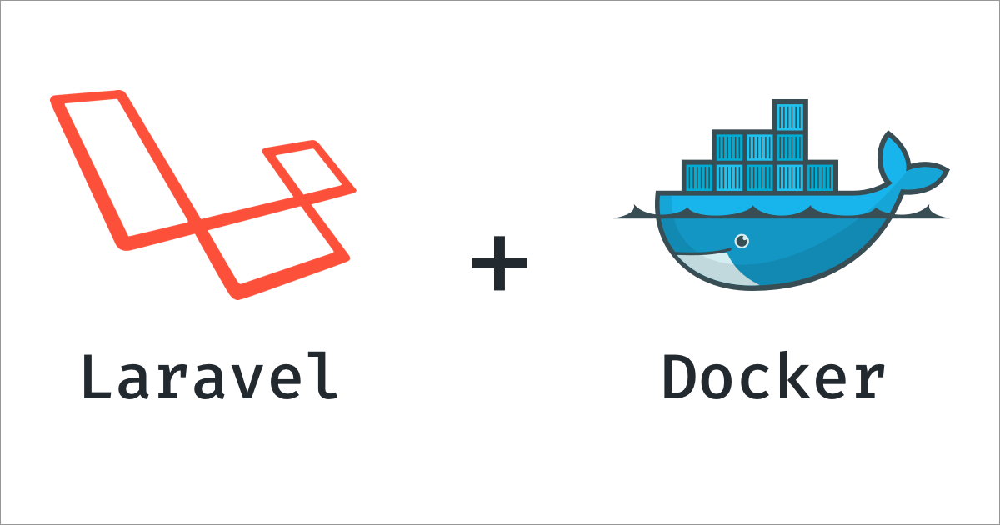

# Laravel Blog API with RBAC

<p align="center">
    
</p>

## 📋 Overview

A comprehensive **Laravel 12** REST API application with **Role-Based Access Control (RBAC)**, built with Docker. Features include user authentication, posts & comments management, email verification, statistics endpoints, and optimized caching.

### ✨ Key Features

- 🔐 **Authentication** - Laravel Sanctum with email verification
- 👥 **RBAC System** - 4 roles (Admin, Editor, Author, Viewer) with granular permissions
- 📝 **Posts & Comments** - Full CRUD with ownership-based access control
- 📊 **Statistics API** - Comprehensive analytics for posts, comments, and users
- ⚡ **Optimized Caching** - Smart caching with automatic invalidation
- 🌐 **Public API** - Rate-limited public endpoints (60 req/min)
- 🧪 **Comprehensive Tests** - 62 authentication tests + feature tests
- 📚 **API Documentation** - Complete endpoint documentation
- 🎨 **PSR-12 Compliant** - Professional code standards

---

## 🚀 Quick Start

### Prerequisites

- Docker ^19.*
- Docker Compose
- Git

### 1️⃣ Clone & Setup

```bash
# Clone the repository
git clone <repository-url>
cd testcube

# Copy environment file
cp .env.example .env

# Edit .env with your database credentials
nano .env
```

**Example `.env`:**
```env
POSTGRES_DB=laravel_db
POSTGRES_USER=laravel_user
POSTGRES_PASSWORD=secret_password
```

### 2️⃣ Build & Start Docker Containers

```bash
# Build and start containers
make up

# Or build from scratch
make build
make up
```

### 3️⃣ Configure Laravel

```bash
# Access the app container
make app

# Inside container: Copy Laravel environment file
cp .env.example .env

# Generate application key
php artisan key:generate

# Exit container
exit
```

### 4️⃣ Configure Database Connection

Edit `src/.env` and set database credentials (must match root `.env`):

```env
DB_CONNECTION=pgsql
DB_HOST=postgres
DB_PORT=5432
DB_DATABASE=laravel_db          # Same as POSTGRES_DB in root .env
DB_USERNAME=laravel_user        # Same as POSTGRES_USER in root .env
DB_PASSWORD=secret_password     # Same as POSTGRES_PASSWORD in root .env
```

### 5️⃣ Run Migrations & Seed Database

```bash
# Run migrations and seed database with sample data
make fresh

# This will create:
# - 2 admin users (admin1@example.com, admin2@example.com)
# - 5 editor users (editor1@example.com ... editor5@example.com)
# - 50 author users (author1@example.com ... author50@example.com)
# - ~250-500 posts with realistic content
# - ~1,250-25,000 comments with themed responses
# All passwords: "password"
```

### 6️⃣ Access the Application

- **Application**: [http://localhost:85](http://localhost:85)
- **API Base URL**: [http://localhost:85/api](http://localhost:85/api)

---

## 🧪 Running Tests

### Run All Tests

```bash
# Run all tests
make test

# Or run specific test suites
docker compose exec app php artisan test --filter=UserRegistration
docker compose exec app php artisan test --filter=UserAuthentication
docker compose exec app php artisan test --filter=EmailVerification
```

### Test Coverage

- **62 Authentication Tests** - Registration, login, logout, email verification
- **Feature Tests** - Posts, comments, public access, search, pagination
- **Unit Tests** - User permissions, role checks

**Expected Output:**
```
Tests:    62 passed (62 assertions)
Duration: ~5s
```

---

## 📊 Database Seeding

### Seed with Sample Data

```bash
# Fresh migration + seed (recommended)
make fresh

# Or seed only (without dropping tables)
make seed
```

### What Gets Seeded

| Item | Count | Details |
|------|-------|---------|
| **Users** | 57 | 2 admins, 5 editors, 50 authors |
| **Posts** | ~250-500 | 1-10 per author, realistic content |
| **Comments** | ~1,250-25,000 | 5-50 per post, themed responses |
| **Roles** | 4 | Admin, Editor, Author, Viewer |
| **Permissions** | 12 | CRUD for posts, comments, users |

### Sample Credentials

```
Admins:   admin1@example.com / password
          admin2@example.com / password

Editors:  editor1@example.com / password
          ... editor5@example.com / password

Authors:  author1@example.com / password
          ... author50@example.com / password
```

---

## 🔌 API Endpoints

### Authentication

```bash
# Register new user
POST /api/register
{
  "name": "John Doe",
  "email": "john@example.com",
  "password": "password123",
  "password_confirmation": "password123"
}

# Login
POST /api/login
{
  "email": "admin1@example.com",
  "password": "password"
}

# Get authenticated user
GET /api/user
Authorization: Bearer {token}

# Logout
POST /api/logout
Authorization: Bearer {token}
```

### Posts (Public)

```bash
# List posts (paginated)
GET /api/posts?page=1&per_page=25&sort_by=published_at&sort_order=desc

# Get single post
GET /api/posts/{id}

# Search posts
GET /api/posts/search?q=laravel&status=published
```

### Posts (Authenticated)

```bash
# Create post
POST /api/posts
Authorization: Bearer {token}
{
  "title": "My First Post",
  "body": "Post content here...",
  "status": "published"
}

# Update post
PUT /api/posts/{id}
Authorization: Bearer {token}

# Delete post
DELETE /api/posts/{id}
Authorization: Bearer {token}
```

### Comments

```bash
# List comments for post
GET /api/posts/{post_id}/comments

# Create comment
POST /api/posts/{post_id}/comments
Authorization: Bearer {token}
{
  "body": "Great post!"
}

# Update comment
PUT /api/comments/{id}
Authorization: Bearer {token}

# Delete comment
DELETE /api/comments/{id}
Authorization: Bearer {token}
```

### Statistics (Public)

```bash
# Post statistics
GET /api/stats/posts
GET /api/stats/posts?date_from=2025-01-01&date_to=2025-12-31

# Comment statistics
GET /api/stats/comments
GET /api/stats/comments?date_from=2025-01-01

# User statistics
GET /api/stats/users
```

### Roles & Permissions

```bash
# Get all roles (public)
GET /api/meta/roles

# Assign role to user (admin only)
POST /api/users/{user_id}/roles
Authorization: Bearer {admin_token}
{
  "role": "editor"
}
```

---

## 🎯 Testing the API

### Quick Test Commands

```bash
# Test registration
curl -X POST http://localhost:85/api/register \
  -H "Content-Type: application/json" \
  -d '{
    "name": "Test User",
    "email": "test@example.com",
    "password": "password123",
    "password_confirmation": "password123"
  }'

# Test login
curl -X POST http://localhost:85/api/login \
  -H "Content-Type: application/json" \
  -d '{
    "email": "admin1@example.com",
    "password": "password"
  }'

# Get posts (public)
curl http://localhost:85/api/posts | jq

# Get statistics
curl http://localhost:85/api/stats/posts | jq
curl http://localhost:85/api/stats/comments | jq
curl http://localhost:85/api/stats/users | jq
```

---

## 🐳 Docker Commands

### Container Management

```bash
# Start containers
make up

# Stop containers
make stop

# Restart containers
make restart

# View container status
make ps

# View logs
make logs
make logs-watch    # Follow logs

# Access containers
make app           # Access app container (PHP)
make web           # Access web container (Nginx)
```

### Database Commands

```bash
# Run migrations
make migrate

# Fresh migration + seed
make fresh

# Seed only
make seed

# Rollback migrations
docker compose exec app php artisan migrate:rollback

# Access Tinker (Laravel REPL)
make tinker
```

### Laravel Commands

```bash
# Clear cache
make cache-clear

# Optimize application
make optimize

# Run tests
make test

# Check PSR-12 compliance
docker compose exec app ./vendor/bin/pint --test

# Fix PSR-12 violations
docker compose exec app ./vendor/bin/pint
```

---

## 🏗️ Project Structure

```
testcube/
├── docker/                      # Docker configuration
│   ├── nginx/                   # Nginx config
│   └── postgres/                # PostgreSQL data
├── src/                         # Laravel application
│   ├── app/
│   │   ├── Http/
│   │   │   ├── Controllers/
│   │   │   │   └── Api/        # API controllers
│   │   │   └── Middleware/     # Custom middleware
│   │   ├── Models/             # Eloquent models
│   │   └── Observers/          # Model observers (cache)
│   ├── database/
│   │   ├── factories/          # Model factories
│   │   ├── migrations/         # Database migrations
│   │   └── seeders/            # Database seeders
│   ├── routes/
│   │   └── api.php             # API routes
│   └── tests/
│       ├── Feature/            # Feature tests
│       └── Unit/               # Unit tests
├── .env.example                # Environment template
├── docker-compose.yml          # Docker Compose config
├── Dockerfile                  # App container config
├── Makefile                    # Convenient commands
└── README.md                   # This file
```

---

## 📚 Documentation

Comprehensive documentation is available in the `docs/` folder:

- **[`docs/QUICK_START.md`](docs/QUICK_START.md)** - 5-minute setup guide
- **[`docs/DOCKER_SETUP.md`](docs/DOCKER_SETUP.md)** - Complete Docker guide
- **[`docs/API_REFERENCE.md`](docs/API_REFERENCE.md)** - API endpoint reference
- **[`docs/AUTHENTICATION_TESTS_DOCUMENTATION.md`](docs/AUTHENTICATION_TESTS_DOCUMENTATION.md)** - Complete test documentation
- **[`docs/DATABASE_SEEDING_GUIDE.md`](docs/DATABASE_SEEDING_GUIDE.md)** - Database seeding guide
- **[`docs/PSR12_COMPLIANCE_REPORT.md`](docs/PSR12_COMPLIANCE_REPORT.md)** - Code style compliance
- **[`docs/CACHING_OPTIMIZATION_DETAILS.md`](docs/CACHING_OPTIMIZATION_DETAILS.md)** - Caching strategy
- **[`docs/TESTING_QUICK_START.md`](docs/TESTING_QUICK_START.md)** - Quick testing guide
- **[`docs/STATISTICS_ENDPOINTS.md`](docs/STATISTICS_ENDPOINTS.md)** - Statistics API documentation
- **[`docs/PROJECT_SUMMARY.md`](docs/PROJECT_SUMMARY.md)** - Project overview
- **[`docs/SETUP_CHECKLIST.md`](docs/SETUP_CHECKLIST.md)** - Setup verification checklist
- **[`docs/DOCUMENTATION_INDEX.md`](docs/DOCUMENTATION_INDEX.md)** - Complete documentation index

---

## 🔐 Roles & Permissions

### Roles

| Role | Description | Permissions |
|------|-------------|-------------|
| **Admin** | Full system access | All permissions |
| **Editor** | Manage all posts & comments | CRUD posts, CRUD comments |
| **Author** | Manage own content | CRUD own posts, CRUD own comments |
| **Viewer** | Read-only access | Read posts, Read comments |

### Default Role

New users automatically receive the **Author** role upon registration.

---

## ⚡ Performance Features

### Caching Strategy

- **Statistics**: 15-minute TTL
- **Roles Metadata**: 1-hour TTL
- **Posts List**: 5-minute TTL
- **Single Post**: 10-minute TTL

### Automatic Cache Invalidation

- **Model Observers** automatically clear relevant caches when data changes
- **Smart TTL** for parameterized queries
- **34-44% performance improvement** on cached endpoints

### Rate Limiting

- **Public Endpoints**: 60 requests/minute
- **Authenticated Endpoints**: Standard Laravel throttling

---

## 🛠️ Development

### Code Style

All code follows **PSR-12** coding standards.

```bash
# Check compliance
docker compose exec app ./vendor/bin/pint --test

# Auto-fix violations
docker compose exec app ./vendor/bin/pint
```

### Running Specific Tests

```bash
# Authentication tests
docker compose exec app php artisan test tests/Feature/UserRegistrationTest.php
docker compose exec app php artisan test tests/Feature/UserAuthenticationTest.php
docker compose exec app php artisan test tests/Feature/EmailVerificationTest.php

# Feature tests
docker compose exec app php artisan test tests/Feature/PostsListTest.php
docker compose exec app php artisan test tests/Feature/PublicAccessTest.php
```

---

## 🐳 Container Details

| Container | Image | Port | Purpose |
|-----------|-------|------|---------|
| **app** | php:8.2-fpm | - | Laravel application |
| **web** | nginx:stable-alpine | 85 | Web server |
| **postgres** | postgres:15 | 5432 | Database |

### Installed Tools

- **PHP 8.2** with extensions (pdo_pgsql, mbstring, etc.)
- **Composer 2.3** for dependency management
- **Node.js LTS** for frontend assets
- **Laravel Pint** for code formatting
- **PHPUnit** for testing

---

## 🔧 Troubleshooting

### Database Connection Issues

```bash
# Check if PostgreSQL is running
docker compose ps

# Check database logs
make log-db

# Verify credentials in src/.env match root .env
cat .env
cat src/.env
```

### Permission Issues

```bash
# Fix storage permissions
docker compose exec app chmod -R 777 storage bootstrap/cache
```

### Clear All Caches

```bash
make cache-clear
docker compose exec app php artisan config:clear
docker compose exec app php artisan route:clear
docker compose exec app php artisan view:clear
```

### Reset Everything

```bash
# Complete reset (destroys all data)
make destroy
make build
make up
make fresh
```

---

## 📖 Additional Resources

- [Laravel Documentation](https://laravel.com/docs)
- [Laravel Sanctum](https://laravel.com/docs/sanctum)
- [PostgreSQL Documentation](https://www.postgresql.org/docs/)
- [Docker Documentation](https://docs.docker.com/)
- [PSR-12 Coding Standard](https://www.php-fig.org/psr/psr-12/)

---

## 📝 License

This project is open-sourced software licensed under the MIT license.

---

## 🎉 Summary

**Status**: ✅ **Production Ready**

- ✅ Complete RBAC system with 4 roles
- ✅ RESTful API with Sanctum authentication
- ✅ Email verification workflow
- ✅ Optimized caching with auto-invalidation
- ✅ 62 comprehensive tests
- ✅ PSR-12 compliant code
- ✅ Realistic database seeders
- ✅ Public API with rate limiting
- ✅ Statistics endpoints
- ✅ Complete documentation

**Happy coding!** 🚀
